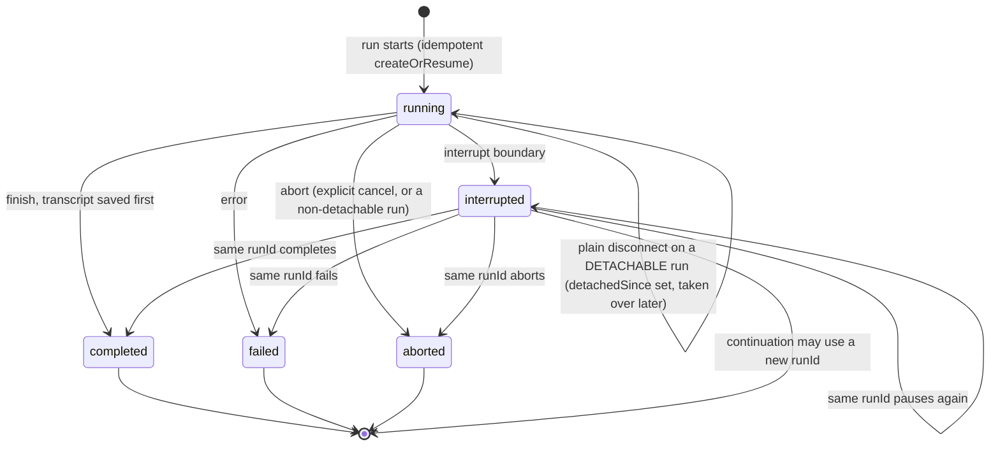
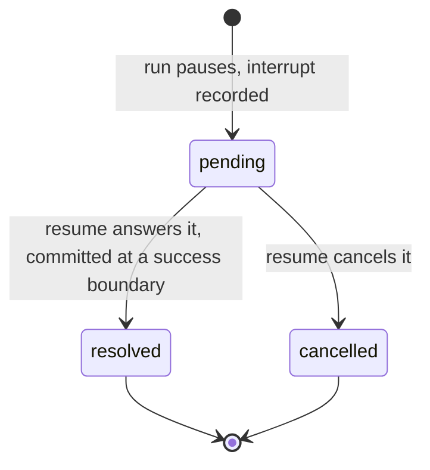

# Chat Persistence

You want a conversation to outlive a single request: the transcript, whether
each run finished or is still waiting on an interrupt, all still there after the
process restarts. `withPersistence` is a chat middleware that writes that
state to a store you choose, so the server owns an authoritative copy of every
thread.

<!-- ::start:tabs variant="package-manager" mode="install" -->

react: @tanstack/ai-persistence
vue: @tanstack/ai-persistence
solid: @tanstack/ai-persistence
svelte: @tanstack/ai-persistence
preact: @tanstack/ai-persistence
angular: @tanstack/ai-persistence
vanilla: @tanstack/ai-persistence
octane: @tanstack/ai-persistence

<!-- ::end:tabs -->

<!-- ::start:tabs variant="package-manager" mode="local-install" -->

react: @tanstack/intent@latest install
vue: @tanstack/intent@latest install
solid: @tanstack/intent@latest install
svelte: @tanstack/intent@latest install
preact: @tanstack/intent@latest install
angular: @tanstack/intent@latest install
vanilla: @tanstack/intent@latest install
octane: @tanstack/intent@latest install

<!-- ::end:tabs -->

The second command wires this package's [Agent Skills](../getting-started/agent-skills)
into your coding assistant. Run it before you start, because the recipes read your
existing database setup and write the adapter to match, and they encode the
invariants (full-overwrite `saveThread`, insert-if-absent run and interrupt
creates) that are easy to get wrong and expensive to debug.

## Persist state on the server

Add the middleware to `chat()` and point it at a backend. Here `persistence` is a
local `./persistence` module: an adapter you build on the core over the database
you already run. [Build your own adapter](./build-your-own-adapter) walks through
a complete SQLite version end to end.

```ts group=chat-persistence
import {
  chat,
  chatParamsFromRequestBody,
  toServerSentEventsResponse,
} from '@tanstack/ai'
import { openaiText } from '@tanstack/ai-openai'
import { withPersistence } from '@tanstack/ai-persistence'
import { persistence } from './persistence'

export async function POST(request: Request) {
  const params = await chatParamsFromRequestBody(await request.json())
  const stream = chat({
    adapter: openaiText('gpt-5.5'),
    messages: params.messages,
    threadId: params.threadId,
    runId: params.runId,
    // Forward the resume batch so a thread with pending interrupts continues.
    ...(params.resume ? { resume: params.resume } : {}),
    middleware: [withPersistence(persistence)],
  })
  return toServerSentEventsResponse(stream)
}
```

The middleware uses whichever **state** stores the backend provides, no feature
flags. `messages` is required; the rest are optional:

- `messages` (required) loads and saves the full model-message thread.
- `runs` records running, interrupted, completed, failed, or aborted status.
- `interrupts` records pending tool-approval / client-tool / generic waits, and
  requires `runs`.

Need a mutex across workers? Add `withLocks` when other middleware needs
multi-instance coordination; see [Locks](../advanced/locks).

Creating tables on open is convenient for local development. In production, apply
schema changes through your deployment workflow instead. See
[Migrations](./migrations).

## Threads, runs, and turns

The transcript is stored per `threadId`, and each run gets a `runs` record with its
status, timings, and reported usage across provider calls. One thing follows from
that and matters when you wire a client: a reconnecting client never has to present
a run id it may no longer know. The store resolves the thread's live run with
`findActiveRun(threadId)` and the client tails that.

[Id map](./id-map) covers how to choose a thread id and what both ids mean on the
generation hooks. [How persistence works](./internals) has the rest.

## Subagent cards on reload

When the run store keeps the child link, a refresh shows each subagent as a card.

Save these three fields on the child run. `createOrResume` writes them on the first insert:

- `parentRunId`: the chat run that started the child.
- `subagentRunId`: the child run id.
- `name`: the agent name.

`reconstructChat` calls `listByParentRun`. It puts one card on the parent assistant message for each child. Each card gets the child's full transcript back: text, reasoning, tool calls, and tool results. Nested children come back as nested cards.

A child that waits for an approval comes back with `status: 'suspended'`, and its interrupt stays pending. The reloaded client can answer it, and the next run continues that child.

A child that a tool call started sits on the message with that tool call. `reconstructChat` finds its parent run with `listByThread`, so implement that method too.

Put `withPersistence` on the parent `chat()` only, not on a child `chat()`. The parent stores the child runs. A child with its own `withPersistence` stores the same child a second time, and its interrupt records conflict with the parent's.

Subagent support is optional. If the store omits `listByParentRun`, a reload shows the saved text and the cards stay absent. The conformance suite skips the subagent checks with no `skipMethods` entry.

The columns and the method are in the [store reference](./store-reference).

## Keep every stored message

`withPersistence` merges incoming `messages` into the stored thread by id.

If `messages` is empty, the middleware loads the stored transcript and the run
continues from there.

If `messages` is not empty, the middleware merges by id:

- The last incoming id that already exists in stored is a cutoff. Stored
  messages after it are dropped. That is how reload removes the old assistant.
- If no incoming id is in stored, every stored message stays (a new turn).
- Same id in both lists: incoming wins.
- New ids and messages with no id are appended.

`saveThread` replaces the stored thread with that merged list.

A client with `history: { pageSize }` posts only the new turn. Reload posts
the last user. Resume posts from that user through the painted assistant.
See [Client persistence](./client-persistence).

## Compaction keeps the transcript complete

Do you add [`withCompaction`](../advanced/compaction) to the same `chat()`? The
saved thread remains canonical. Compaction changes only the provider context,
not `ctx.messages`. The message store keeps dropped content, summaries do not
replace old turns, and cleared tool output remains available for reloads.

If your adapter provides `stores.metadata`, `withPersistence` exposes it to
other middleware. Compaction uses it automatically for validated checkpoints.
See
[Compaction and persistence](../advanced/compaction#compaction-and-persistence).

## What gets persisted, and when

`withPersistence` writes at **four** moments so a reload never loses a turn:

| Moment | What is written | Best-effort? |
| --- | --- | --- |
| **Start of a run** (`onStart`) | Pending turn (just-submitted user message + prior history) so a reload mid-generation still shows the question | Yes. Failure does not abort the run; finish is authoritative |
| **Interrupt boundary** | New interrupt records, run status `interrupted`, known usage, and a thread snapshot of current messages | No. Store failures propagate |
| **Finish** (`onFinish`) | Complete transcript (including completed assistant messages, the terminal reply's stream `messageId` for in-place reload identity, and any completed structured-output part), run status `completed`, known usage, and commit of consumed resumes | No. The transcript is saved **before** the run is marked completed |
| **Optionally while streaming** | Throttled partial assistant text when `snapshotStreaming: true` | Yes |

```ts group=chat-persistence
const streamingMiddleware = [
  withPersistence(persistence, { snapshotStreaming: true }),
]
```

Streaming snapshots default off (finish is the authoritative save); enable
them to trade extra writes for partial-output durability. Tune the interval
with `snapshotIntervalMs` (default `1000`).

The chat engine completes the canonical transcript before `onFinish` runs, and
`withPersistence` saves that transcript directly.

- Native-combined output keeps the structured result on its terminal assistant
  message.
- Separate finalization can preserve a plain-text assistant message followed by
  a structured-output assistant message.
- Harness adapters emit `structured-output.complete` during the run. A new
  message id stores prose and structured output as two assistant messages. The
  last text message id keeps both on one assistant message.

A server-authoritative client hydrates that transcript on mount. Walk
`messages[].parts` for the reconstructed structured-output part:

```tsx group=chat-persistence
import { fetchServerSentEvents, useChat } from '@tanstack/ai-react'
import { z } from 'zod'

const PersonSchema = z.object({ name: z.string() })

function PersistentStructuredChat({ threadId }: { threadId: string }) {
  const { messages } = useChat({
    threadId,
    connection: fetchServerSentEvents('/api/chat'),
    persistence: true,
    outputSchema: PersonSchema,
  })

  return (
    <div>
      {messages.map((message) => {
        const part = message.parts.find(
          (candidate) => candidate.type === 'structured-output',
        )
        if (!part) return null
        const person = part.data ?? part.partial
        return <p key={message.id}>{person?.name}</p>
      })}
    </div>
  )
}
```

The matching server `GET` uses `reconstructChat`. See
[Client persistence](./client-persistence).

On **error**, the run is marked `failed`. On **abort**, the run is marked
`aborted` with a `finishedAt`; `interrupted` is written only at an interrupt
boundary, and it is not terminal. Both terminal paths retain usage reported
before the failure or abort. Resumes accepted in `onConfig` are **not**
consumed until a success boundary (interrupt or finish). If a run fails before
the resume commit, every pending interrupt stays retryable. The same is true
when an atomic `commitBatch()` fails: the whole batch stays pending.

The legacy sequential fallback is different. A write can fail after earlier
entries were committed. Reload the thread's current pending interrupt records
and submit only that remaining batch. Do not resend the original full batch.

One abort does **not** terminalize: a plain client disconnect on a run that some
other middleware has declared *detachable* (a durable event log plus a run
store, in practice `withSandbox` with durability wired). There, `onAbort` writes
nothing at all, the record stays `'running'`, and the detach path records
`detachedSince` so a later request can take the run over. Intent is never
inferred from the disconnect itself, because a user pressing Stop and a user
closing the tab produce the identical connection close; a cancel arrives out of
band, either as the run's own abort reason or as `RunRecord.cancelRequested`, and
either one makes the abort terminal again. See
[Takeover & Detached Runs](../sandbox/takeover#detach-vs-cancel).

The lifecycle a run record moves through. `completed`, `failed`, and `aborted`
are terminal; `interrupted` is **parked**, not terminal. The normal client flow
starts a continuation with a fresh `runId`. A server integration can reuse the
same `runId`; `createOrResume` leaves its status `interrupted` until the next
interrupt or terminal boundary. `findActiveRun` only returns `running` records,
so it cannot discover a same-ID continuation while that continuation executes.



## Interrupts survive a restart

When a run pauses on an interrupt (a tool approval, a client-side tool, or a
generic middleware request), the middleware records it. A later request on that
thread must carry a `resume` batch that answers the pending interrupts before
new input is accepted, otherwise it is rejected, which is why the example above
forwards `params.resume`.

For a mixed batch, the persistence middleware validates every entry before it
continues. It commits all resolved and cancelled entries at one success
boundary. An `InterruptStore` can implement `commitBatch()` to make that write
atomic. Without it, the compatibility fallback writes entries one at a time and
is not atomic.

Persistence is the **server-authoritative resume path**: the middleware
validates the resume batch against pending interrupts, builds
`ChatResumeToolState` (approvals / client-tool results / generic requests), and
**clears** `config.resume` so the chat engine skips its ephemeral
reconstruction (which needs client message history the persistence flow
deliberately omits). Resumes are committed (resolved/cancelled in the store)
only once the run reaches a successful interrupt or finish boundary.

`onInterruptResolution` still runs at the same moment as a request without
persistence: after init `onConfig`, before `onStart`. See
[Apply Answers](../interrupts/apply-answers).

An interrupt record is born `pending` and only a commit moves it. With
`commitBatch()`, a failed commit leaves the full batch answerable again. With
the sequential fallback, reload first because some earlier entries may already
be resolved or cancelled:



## Where to go next

- Bring durability to the browser too, so a full page reload restores the
  conversation and rejoins an in-flight run: [Client persistence](./client-persistence).
- Build the backend on the core, and look up the store contracts:
  [Build your own adapter](./build-your-own-adapter). Whatever you already run
  (Drizzle, Prisma, Cloudflare D1, raw SQL), install the shipped
  [Agent Skills](../getting-started/agent-skills) with
  `npx @tanstack/intent@latest install` and have your assistant write the
  `chat-persistence.ts` against your existing schema.
- Choose which stores to run: [Controls](./controls).
